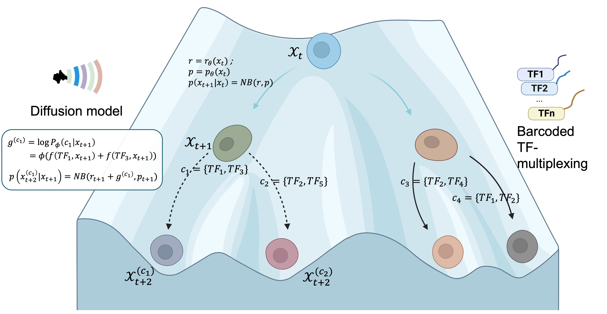

# GenDiff — Diffusion Modeling on the Differentiation Landscape



GenDiff learns a **displacement field** over single-cell state space: for each cell it predicts ΔX,
the change in expression that moves the cell forward along its differentiation trajectory under a given
perturbation (transcription factor, drug, knockout). Training supervision is built by a neighbour
sampler that, for every cell, looks at slightly-more-differentiated neighbours and records the
expression difference. At inference the learned net maps `(expression, condition, pseudotime) → ΔX` in a
single forward pass, so you can read off the predicted direction of motion for any cell under any
condition, integrate it into a trajectory, or compare it against RNA velocity.

The recommended way to use GenDiff is the scvi-tools-style high-level API in the `gendiff` package.

## Installation

Requirements: Python ≥ 3.9, and a CUDA GPU for training (preprocessing and inference run on CPU).
Dependencies are declared in `setup.py`: PyTorch, PyTorch-Lightning, scanpy, anndata,
numpy/scipy/scikit-learn, pandas, matplotlib. `pip install -e .` registers the `gendiff`, `gendiff_dev`,
and `src` packages so `import gendiff` resolves from any directory.

**Option A — existing cluster environment (recommended on the HPC).** The `GenDiff_env` mamba env already
has the scientific stack and a CUDA-matched PyTorch; just register the package without touching the
curated dependencies:

```bash
cd /rds/user/wz369/hpc-work/GenDiff
/rds/user/wz369/hpc-work/LIBS/mamba/envs/GenDiff_env/bin/pip install -e . --no-deps
```

**Option B — fresh install with pip + venv.** Install a PyTorch build matching your CUDA *first*, so the
editable install does not pull a mismatched wheel:

```bash
python3 -m venv .venv && source .venv/bin/activate
pip install --upgrade pip
pip install torch --index-url https://download.pytorch.org/whl/cu126   # or your CUDA; omit URL for CPU
cd /rds/user/wz369/hpc-work/GenDiff
pip install -e .                                                       # remaining deps from setup.py
```

**Option C — fresh install with uv** (same idea, faster resolver):

```bash
uv venv && source .venv/bin/activate
uv pip install torch --index-url https://download.pytorch.org/whl/cu126   # or your CUDA; omit URL for CPU
cd /rds/user/wz369/hpc-work/GenDiff
uv pip install -e .
```

Verify the install:

```bash
python -c "import gendiff; print(gendiff.GenDiff)"
```

## Quickstart

```python
from gendiff import GenDiff

# 1. register the data and build the ΔX target (runs the knn sampler once)
GenDiff.setup_anndata(
    adata,
    condition_key="condition",        # obs column: perturbation label
    pseudotime_key="dpt_pseudotime",  # obs column: differentiation axis (control sits low)
    use_rep="X_pca",                  # obsm key: representation for the kNN graph
    control="ctrl",                   # the baseline label -> token 0
    sampler_config="config1",         # geodesic, M=15, repeat=3 (recommended)
)

# 2. build and train
model = GenDiff(adata, hidden_size=(512, 512, 256, 512, 512))
model.train(max_epochs=200, batch_size=128, lr=1e-3)

# 3. predict and persist
dX  = model.predict_delta(adata, condition="Sox2")        # (n_obs, n_genes) displacement field
Xp  = model.predict_population(adata, condition="Sox2")   # X + ΔX
model.save("runs/sox2")
model = GenDiff.load("runs/sox2", adata)
```

## What GenDiff needs from your AnnData

`setup_anndata` checks for four things. The tutorial notebook shows how to compute each if missing.

| Requirement | Where | Notes |
|---|---|---|
| Normalized log-expression | `adata.X` | This is both the model input and the space ΔX lives in. `normalize_total` + `log1p`. |
| Low-dim representation | `adata.obsm[use_rep]` | Used to build the kNN graph for the sampler. `X_pca`, or a batch-corrected `X_pca_harmony`. |
| Pseudotime | `adata.obs[pseudotime_key]` | The differentiation axis; controls should sit low. `sc.tl.dpt` with a control cell as root. |
| Condition column | `adata.obs[condition_key]` | Perturbation labels; one of them is the control (`control=`, inferred if omitted). |

## Samplers (the ΔX supervision target)

The ΔX supervision is built once inside `setup_anndata`. The `sampler` argument picks **how** the target
field is constructed; all of them return a per-cell gene-space ΔX written to `obsm["gendiff_dX"]`:

| `sampler` | what ΔX is | needs | when to use |
|---|---|---|---|
| `"knn"` (default) | mean displacement to higher-pseudotime neighbours | `use_rep` | the shipped r3 target; pick the preset with `sampler_config` |
| `"smooth_nb"` | d·log1p(μ)/dt of a per-cluster NB mean-expression curve | counts + `louvain` | reversion-free, self-slows at the terminal — the sampler-study winner |
| `"nb_global"` | the same NB derivative, one global trajectory | counts | when there is no meaningful clustering |
| `"ot"` | per-cluster optimal-transport early→late displacement | POT + `louvain` | manifold-robust alternative (transports to real late cells) |
| `"ptgrad"` | gene-space gradient of pseudotime | `use_rep` | most forward-reaching, but off-manifold and perturbation-blind — ablation only |
| `"smooth"` | generic `smooth_deriv` escape hatch | — | choose `mode` via `sampler_kwargs` (`nb`/`gauss`/`local`/`auto`, `auto_root`) |

The NB/OT samplers fall back gracefully (NB → spline if no counts; per-cluster → one global cluster if no
`louvain`), printing what they actually ran. The recommended default for trajectory supervision is
`smooth_nb`; `ptgrad` reaches furthest but over-disperses and is **not** recommended as a default (see
`GenDiff-manuscript/response/SAMPLER_OPT/FINDINGS.md`).

For `sampler="knn"`, pick the parameter combination with `sampler_config`:

| `sampler_config` | metric | M | repeat | meaning |
|---|---|---|---|---|
| `"config1"` (default) | geodesic | 15 | 3 | the recommended r3 setting |
| `"config2"` | euclid | 30 | 3 | metric-tie reference (r3_euclid_m30) |
| `"others"` | your choice | your choice | your choice | pass `sampler_kwargs={"metric":..., "M":..., "repeat":...}` |

`same_condition` (whether neighbours must share the perturbation) defaults to `"auto"`: it is set True
when conditions are densely sampled (median ≥ 50 cells/condition) and False otherwise. The sampler
prints the exact settings it runs, and how many cells had no eligible higher-pseudotime neighbour
(those get ΔX = 0).


- [`tutorials/1_preprocessing_and_training.ipynb`](tutorials/1_preprocessing_and_training.ipynb) — from a
  raw-ish AnnData to a trained, saved model: the four preprocessing requirements, `setup_anndata`,
  inspecting the built ΔX target, and training.
- [`tutorials/2_downstream_analysis.ipynb`](tutorials/2_downstream_analysis.ipynb) — load a trained model
  and analyze it: per-condition ΔX and predicted populations, top moving genes, displacement vs
  pseudotime, plotting the field on the embedding, integrating trajectories, and comparing to RNA
  velocity.

The notebooks are runnable templates; they have not been executed here (training needs a GPU and the
full datasets). Expect a 2k-cell dataset to train in a few minutes on one GPU.

