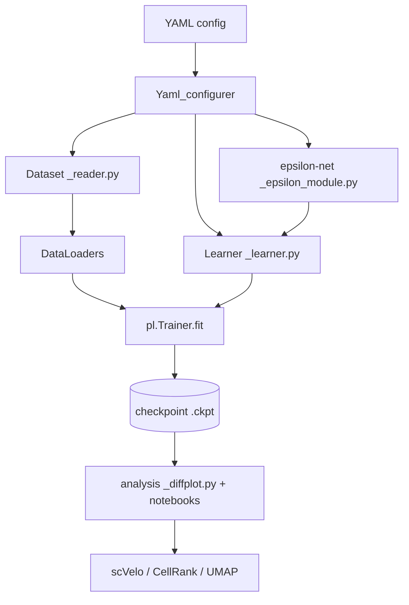

# Codebase Memory: GenDiff — Diffusion Modeling on the Differentiation Landscape
> Generated: 2026-06-08 | Verified: 2026-06-08 | Generator: codebase-memory skill v1
> Modules: [models](modules/models.md) · [diffusion](modules/diffusion.md) · [data](modules/data.md) · [analysis](modules/analysis.md) · [scripts](modules/scripts.md) · [configs](modules/configs.md) · [tutorials](modules/tutorials.md)

## 1. PURPOSE & DOMAIN
GenDiff is a research package (`setup.py` name `GenDiff`) for **conditional generative
modelling of single-cell perturbation data**. It treats cell differentiation as movement on a
Waddington-style landscape and learns a **conditional displacement/velocity field**: given a
cell's expression `x`, a perturbation `c` (e.g. a transcription factor), and a pseudotime `t`,
a network predicts how the cell moves toward its next state (ΔX). Iterating that field
simulates differentiation trajectories and **in-silico perturbations** (what would happen if we
overexpressed TF X?). Used by computational-biology researchers; primary dataset is the hESC
**TF-Atlas** (Joung et al.), with mESC mesendoderm, Perturb-sci, and Collide-seq as others.

## 2. HIGH-LEVEL ARCHITECTURE
- **Style**: Layered ML research pipeline — `AnnData → Dataset → ε-net → Sampler/Learner → Trainer`, with a separate post-training analysis layer. Configured entirely by YAML.
- **Language(s)**: Python (PyTorch + PyTorch Lightning; scanpy/anndata; scVelo/CellRank in notebooks). Notebooks for analysis.
- **Entry point**: `script/main_train_with_PL_trainer.py --model_config <yaml> --CUDA <id>`.
- **Core data flow**: YAML config → build train/val/test loaders → instantiate ε-network →
  wrap in a diffusion Learner → `pl.Trainer.fit` → checkpoint → analysis (`src/_diffplot.py` + notebooks).



## 3. DIRECTORY MAP
```
src/        → the GenDiff package (model, diffusion, data, analysis)  → modules/*.md
script/     → training entrypoint + data-prep CLIs                    → modules/scripts.md
configs/    → one YAML per experiment (dataset × method)              → modules/configs.md
some_tutorials/ → notebooks: preprocessing + all downstream analysis  → modules/tutorials.md
validation/ → standalone validation notebook
```

## 4. KEY DESIGN DECISIONS & PATTERNS
- **Displacement field, not noise**: despite "Epsilon"/"Diffusion" naming, the trained model
  (`Equivalent_Diffuse_Sampler`) predicts ΔX = (next cell − current cell), a conditional vector
  field on the cell manifold. Standard DDPM/DDIM also exist but are secondary.
- **Conditioning = vector offset in latent space**: TF embedding is *added* to the cell latent
  (`z_c = z + c_emb`); control is always token 0.
- **YAML-driven `eval` dispatch**: class names in configs are `eval`'d to select dataset/model/
  sampler. Config tree = experiment registry.
- **Neighbour-search supervision**: training targets are built by walking the kNN graph to find a
  same-condition, later-pseudotime neighbour (multiple strategies: Diffuse/Path/Root/Traverse).
- **Two parallel impls**: `_learner.py` (Lightning, for training) vs `_sampler.py` (plain, for
  inference) share class names.

## 5. CRITICAL DEPENDENCIES
| Library | Purpose | Key files |
|---------|---------|-----------|
| torch / pytorch_lightning | models, training loop | src/_epsilon_module.py, src/_learner.py |
| scanpy / anndata | single-cell data containers, kNN, pseudotime | src/_reader.py, src/_pp_fun.py |
| einops | tensor reshapes in attention | src/_helper_net.py |
| scvelo / cellrank | velocity & trajectory analysis | src/_diffplot.py, notebooks |
| scipy (dijkstra) | graph distance/depth for neighbour search | src/_reader.py, src/_pp_fun.py |
| scvi-tools / cpa | NB-VAE side experiment | src/my_VAE.py |
| torchdyn (NeuralODE) | ODE_learner | src/_learner.py |

## 6. MODULE REGISTRY
| Module | Path | Deep-dive |
|--------|------|-----------|
| models | src/_epsilon_module.py, _helper_net.py, _linear.py, my_VAE.py | [modules/models.md](modules/models.md) |
| diffusion | src/_sampler.py, _learner.py | [modules/diffusion.md](modules/diffusion.md) |
| data | src/_reader.py, _configure.py, _pp_fun.py, _sc_explore_fn.py | [modules/data.md](modules/data.md) |
| analysis | src/_diffplot.py + analysis scripts | [modules/analysis.md](modules/analysis.md) |
| scripts | script/ | [modules/scripts.md](modules/scripts.md) |
| configs | configs/ | [modules/configs.md](modules/configs.md) |
| tutorials | some_tutorials/, validation/ | [modules/tutorials.md](modules/tutorials.md) |

## 7. DATA MODELS (summary)
- **Training batch (5-tuple)**: `(X, batch_idx, condition_idx, ΔX/target, t)` — emitted by every
  dataset; the learner unpacks it as `(x_0, exp_batch, c, noise=ΔX, t)`. `ODE_dataset` emits an 8-tuple.
- **AnnData contract**: `obs[condition_key]` (TF / target_genes), `obs['discrete_time']` &
  `obs['Depth_from_root']`, `obsp[*connectivities/*distances]` (kNN graph), `uns['iroot']`,
  `uns[unique_token_dict]` (token→index, 0 = control). gene_dim ≈ 4806 HVGs, ~3551 TF tokens (TF-Atlas).
- **Checkpoints**: Lightning `.ckpt` under `pth_dir/<config_subdir>/<epsilon_class>_<run_name>/`.

## 8. GOTCHAS & NON-OBVIOUS BEHAVIOUR
- `machine_config.json` (main_dir/data_dir/pth_dir) is **required but gitignored** — read by
  `src/__init__.py`, `src/PATH.py`, `script/path_n_util.py`. Absent here; must be recreated per host.
- `anndata_path` in configs are absolute paths to an old machine (`/home/wergillius/...`).
- "noise" everywhere means **ΔX**, not Gaussian noise, for the main (Equivalent) sampler.
- Forward arg order flips: learner `forward(x,t,b,c)` → model `forward(x,c,b,t)`.
- Same class names in `_learner.py` (train) vs `_sampler.py` (sample); `_epsilon_module_old.py` is dead.
- Known WIP/buggy paths: `Fix_Degree_Diffuse`, `Diffuse_Dataset._diffuse_keepi`,
  `Latent_Interaction.interact`, `my_VAE` typos, `DDPM_reconX.__init__` arg order.
- `from turtle import forward` is a harmless stray import repeated across files.

## 9. AGENT TASK ROUTING HINTS
- "Change the network / add an ε architecture" → src/_epsilon_module.py + [modules/models.md](modules/models.md)
- "Change the diffusion math / loss / training loop" → src/_learner.py, src/_sampler.py + [modules/diffusion.md](modules/diffusion.md)
- "How are training pairs / ΔX built? add a dataset" → src/_reader.py + [modules/data.md](modules/data.md)
- "Run / configure an experiment" → script/main_train_with_PL_trainer.py + configs/ + [modules/scripts.md](modules/scripts.md), [modules/configs.md](modules/configs.md)
- "Sample ΔX / perturb / trajectories / velocity" → src/_diffplot.py + [modules/analysis.md](modules/analysis.md)
- "What analyses/figures exist for dataset X?" → [modules/tutorials.md](modules/tutorials.md)
- "Find class X / function Y" → memory/maps/file_index.json
- "Understand ripple effects of a change" → memory/maps/call_graph.json
