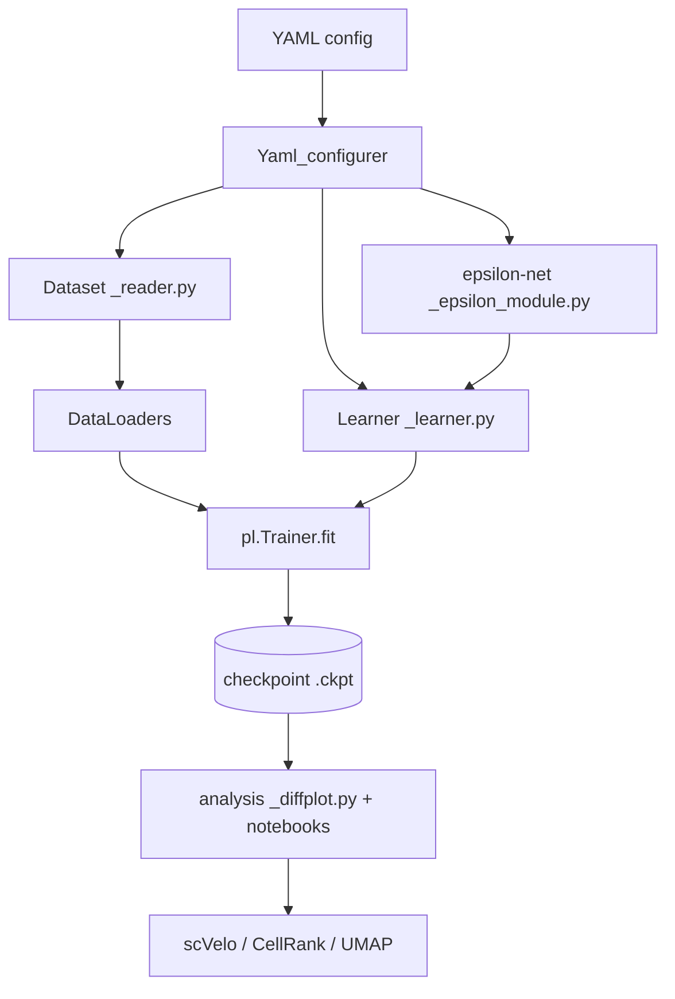

# Codebase Memory: GenDiff — Diffusion Modeling on the Differentiation Landscape
> Generated: 2026-06-08 | Verified: 2026-06-08 | Generator: codebase-memory skill v1
> Updated: 2026-06-08 — added the **MANUSCRIPT MODEL** section after tracing the paper's TF-Atlas
> figures (Figs 4–6) to `some_tutorials/TF-atlas/quick_train/`. The published GenDiff for the TF-Atlas
> is `_linear.Pretrained_GenDiff`, **not** the `Equivalent_Diffuse_Sampler` diffusion pipeline.
> Modules: [models](modules/models.md) · [diffusion](modules/diffusion.md) · [data](modules/data.md) · [analysis](modules/analysis.md) · [scripts](modules/scripts.md) · [configs](modules/configs.md) · [tutorials](modules/tutorials.md)

## 1. PURPOSE & DOMAIN
GenDiff is a research package (`setup.py` name `GenDiff`) for **conditional generative
modelling of single-cell perturbation data**. It treats cell differentiation as movement on a
Waddington-style landscape and learns a **conditional displacement/velocity field**: given a
cell's expression `x`, a perturbation `c` (e.g. a transcription factor), and a pseudotime `t`,
a network predicts how the cell moves toward its next state (ΔX). Iterating that field
simulates differentiation trajectories and **in-silico perturbations** (what would happen if we
overexpressed TF X?). Used by computational-biology researchers; primary dataset is the hESC
**TF-Atlas** (Joung et al.), with mESC mesendoderm, Perturb-sci, and Collide-seq as others.

> ⚠ **The model behind the manuscript's TF-Atlas figures is not the diffusion pipeline below.** The
> `_epsilon_module` + `Equivalent_Diffuse_Sampler` framework (run via
> `script/main_train_with_PL_trainer.py`) is the *designed* architecture, but the paper's TF-Atlas
> results (Figs 4–6) come from a simpler "quick-train" model — `_linear.Pretrained_GenDiff` — built in
> `some_tutorials/TF-atlas/quick_train/`. BarRNA-seq (Figs 2–3) is a **hybrid**: its benchmark (2a–c)
> uses the same quick-train model, but its trajectory and latent/embedding analyses (2f–g, 3) *do* use
> the diffusion pipeline. See the **MANUSCRIPT MODEL** section before reproducing or citing any number.

## 2. HIGH-LEVEL ARCHITECTURE
- **Style**: Layered ML research pipeline — `AnnData → Dataset → ε-net → Sampler/Learner → Trainer`, with a separate post-training analysis layer. Configured entirely by YAML.
- **Language(s)**: Python (PyTorch + PyTorch Lightning; scanpy/anndata; scVelo/CellRank in notebooks). Notebooks for analysis.
- **Entry point**: `script/main_train_with_PL_trainer.py --model_config <yaml> --CUDA <id>` — this is
  the *framework's* trainer (diffusion/ε pipeline). The **manuscript's TF-Atlas models were trained
  separately** in `some_tutorials/TF-atlas/quick_train/` with a bare `pl.Trainer` and no YAML config
  (see the MANUSCRIPT MODEL section).
- **Core data flow**: YAML config → build train/val/test loaders → instantiate ε-network →
  wrap in a diffusion Learner → `pl.Trainer.fit` → checkpoint → analysis (`src/_diffplot.py` + notebooks).



## 3. DIRECTORY MAP
```
src/        → the GenDiff package (model, diffusion, data, analysis)  → modules/*.md
script/     → training entrypoint + data-prep CLIs                    → modules/scripts.md
configs/    → one YAML per experiment (dataset × method)              → modules/configs.md
some_tutorials/ → notebooks: preprocessing + all downstream analysis  → modules/tutorials.md
validation/ → standalone validation notebook
```

## 4. KEY DESIGN DECISIONS & PATTERNS
- **Displacement field, not noise**: despite "Epsilon"/"Diffusion" naming, the trained model
  (`Equivalent_Diffuse_Sampler`) predicts ΔX = (next cell − current cell), a conditional vector
  field on the cell manifold. Standard DDPM/DDIM also exist but are secondary.
- **Conditioning = vector offset in latent space**: TF embedding is *added* to the cell latent
  (`z_c = z + c_emb`); control is always token 0.
- **YAML-driven `eval` dispatch**: class names in configs are `eval`'d to select dataset/model/
  sampler. Config tree = experiment registry.
- **Neighbour-search supervision**: training targets are built by walking the kNN graph to find a
  same-condition, later-pseudotime neighbour (multiple strategies: Diffuse/Path/Root/Traverse).
- **Two parallel impls**: `_learner.py` (Lightning, for training) vs `_sampler.py` (plain, for
  inference) share class names.

## ⚑ MANUSCRIPT MODEL — what actually produced the TF-Atlas figures (Figs 4–6)
The diffusion pipeline above did **not** produce the paper's TF-Atlas numbers. Those come entirely
from `some_tutorials/TF-atlas/quick_train/`, built from the plain-Lightning baselines in
`src/_linear.py` (no `_epsilon_module`, no `_learner`, no YAML configurer — just `pl.Trainer`). The
published **GenDiff** for the TF-Atlas is `_linear.Pretrained_GenDiff`, assembled from two parts:

- **Pretrained expression AE** (`_linear.Embedding_model`, trained by `quick_train_reconX.py`):
  MLP encoder 4806→512→512 + a TF embedder `nn.Embedding(2535, 32)`; `encode` does
  `concat[z_x(512) ‖ z_c(32)]`→ decoder 544→544→4806. Trained to **reconstruct expression X**
  (`Y = adata.X`), not ΔX. lr 3e-5.
- **Per-gene Ridge prior** (`fit_linear_each_gene.py`): one sklearn `Ridge` per gene on
  `X = [expression(4806) ‖ TF one-hot(2535)]` (= 7341 dims) → target `adata.layers['a3_PathSampled_X']`.
  Coefficients + intercept saved to `ridgemodel_params.npy`; per-gene Pearson r in `ridge_model_r.csv`.
- **`Pretrained_GenDiff.forward`**: a single `nn.Linear(7341→4806)` head **initialised with the Ridge
  coefficients/intercept** is applied two ways and averaged —
  `ΔX̂ = ½·[ head( AE_reconstruct(x) ‖ TF_onehot )  +  head( x ‖ TF_onehot ) ]`.
  The only deep-learned component is the expression AE; the prediction head is the Ridge prior
  (fine-tuned by default, `update_fc=True`, `update_pretrain=True`). lr 1e-5.

Prediction target everywhere is `adata.layers['a3_PathSampled_X']` — the path-sampler (α=3) ΔX
displacement; train/test split is `adata.obs['split']`. Data file in the notebooks is
`…/data/TFAtlas/GSE217460_210322_TFAtlas_differentiated.h5ad` (local equivalent
`data/differentiated_model_velo.h5ad`, 28825×4806 — see [Dataset.md](Dataset.md)).

**Baselines shown in the figures**:
- "Ridge" curve = the torch `_linear.Linear_model` (`nn.Linear(7341→4806)`, MSE + weight decay),
  trained in `2.quick_train.ipynb` (ckpt `lightning_logs/version_2`). The *displayed* Ridge is this
  torch linear model; the sklearn per-gene Ridge above only supplies GenDiff's prior, it is not the
  plotted baseline.
- "CAE" = `_linear.CAE_model` (enc 7341→2048, dec 2048→4806), trained by `quick_train_CAE.py`
  (ckpt `quick_CVAE/lightning_logs/version_12`).

**Notebook → figure map** (all reuse the same `Pretrained_GenDiff`):
- `4.evaluate_in_testset.ipynb` → Fig 4a (r²: all 4806 / 200 HVG / 128 marker genes), 4b (per-cell
  cosine), 4c (cosine vs TF exposure). Also computes the cell-type / expression entropy used later.
- `5.infer_trajectory.ipynb` → predicts ΔX over all cells, writes it as the scVelo velocity matrix,
  saves `GenDiff_inferred_dynamics.h5ad` → Fig 4d–g (velocity streams, entropy roots, certainty).
- `5.1.GenDiff+Cellrank.ipynb` → loads that h5ad, builds CellRank kernels from `uns['velocity_graph']`
  (combined kernel = 0.8·velocity + 0.1·connectivity + 0.1·pseudotime), GPCCA → 9 macrostates → Fig 4h–j
  (`cellrank_GenDiff_abs_p.csv` = absorption probabilities).
- `6.GenDiff_representation.ipynb` → joint-z / z_x latent UMAPs → Fig 5.
- `5.2Perturbation.ipynb` → TF-label permutation + simulated transitions → Fig 6.
- `ZZ_(explore)evaluate_equiv_model.ipynb` is the **only** TF-Atlas notebook that touches the
  `Equivalent_Diffuse_Sampler` diffusion pipeline (configs `TF_atlas_Supervised/debug_Equi.yaml`); it is
  exploratory and did **not** make it into the manuscript.

### BarRNA-seq (Figs 2–3) — a HYBRID, not pure quick-train
Verified in `some_tutorials/Barcodelet/`. Unlike the TF-Atlas, **two different models** produced the
BarRNA-seq figures:
- **Fig 2a–c benchmark → quick-train `Pretrained_GenDiff`** (same recipe as the TF-Atlas, with two
  differences): the pretrained part is a `_linear.CAE_model` reconX (enc [2007,512,512], dec
  [512,512,2000], trained `Y = adata.X` in `3.quick_train_AE.ipynb`, ckpt
  `Barcodelet/CAE_deep_model_reconX/version_5`); the condition is the **7 raw signalling-pathway
  columns** `[RA,Wnt,TgfB,Bmp,Fgf,Notch,Shh]` (no embedding); and the prior is per-gene **`RidgeCV`**
  (`4.get_output_prior.ipynb` → `prior_coef_Jul2.npy` / `prior_intcpt_Jul2.npy`). Target is
  `adata.obsm['Tr_SampledX_r100']` (traverse-sampled ΔX, repeat 100). Baselines: "Ridge" =
  `_linear.Linear_model` (2007→2000), "CAE" = a shallow `_linear.CAE_model`. Assembled and plotted in
  `5.Figure2a-c.ipynb`.
- **Fig 2f–g trajectory + Fig 3 latent / pathway embeddings → the diffusion pipeline.** These come from
  `Epsilon_Linear` + `Equivalent_Diffuse_Sampler` (config
  `configs/Barcodelet/mesc_5layer_k=15_traverse_notime.yaml`; ckpt
  `Barcodelet/Epsilon_Linear_mesc_5layer_k=15_traverse_notime/version_2`), driven by
  `1.sample_DeltaX.ipynb` via `dfp.extrapolate` / `plot_representation` / `sample_Delta_X`
  (`use_rep='z_c'`). The learned condition-embedding table (`n_base_perturbs=106`, `condition_emb_dim=64`)
  is the source of the Fig 3 perturbation-embedding analysis — the quick-train benchmark model has no
  such embedding (it takes raw pathway values), so Fig 3f–g can only come from this diffusion model.
- Caveat: `5.Figure2a-c.ipynb` *also* computes velocity streams from the quick-train GenDiff, so an
  individual stream panel could come from either model; the latent/embedding panels (Fig 3) are
  diffusion-pipeline only.

**Bottom line:** every TF-Atlas figure (4–6) and the BarRNA-seq benchmark (2a–c) use the quick-train
`Pretrained_GenDiff`; the diffusion pipeline (`main_train_with_PL_trainer.py`) **does** appear in the
manuscript, but only for the BarRNA-seq trajectory and latent/embedding analyses (Figs 2f–g, 3).

## 5. CRITICAL DEPENDENCIES
| Library | Purpose | Key files |
|---------|---------|-----------|
| torch / pytorch_lightning | models, training loop | src/_epsilon_module.py, src/_learner.py |
| scanpy / anndata | single-cell data containers, kNN, pseudotime | src/_reader.py, src/_pp_fun.py |
| einops | tensor reshapes in attention | src/_helper_net.py |
| scvelo / cellrank | velocity & trajectory analysis | src/_diffplot.py, notebooks |
| scipy (dijkstra) | graph distance/depth for neighbour search | src/_reader.py, src/_pp_fun.py |
| scvi-tools / cpa | NB-VAE side experiment | src/my_VAE.py |
| torchdyn (NeuralODE) | ODE_learner | src/_learner.py |

## 6. MODULE REGISTRY
| Module | Path | Deep-dive |
|--------|------|-----------|
| models | src/_epsilon_module.py, _helper_net.py, _linear.py, my_VAE.py | [modules/models.md](modules/models.md) |
| diffusion | src/_sampler.py, _learner.py | [modules/diffusion.md](modules/diffusion.md) |
| data | src/_reader.py, _configure.py, _pp_fun.py, _sc_explore_fn.py | [modules/data.md](modules/data.md) |
| analysis | src/_diffplot.py + analysis scripts | [modules/analysis.md](modules/analysis.md) |
| scripts | script/ | [modules/scripts.md](modules/scripts.md) |
| configs | configs/ | [modules/configs.md](modules/configs.md) |
| tutorials | some_tutorials/, validation/ | [modules/tutorials.md](modules/tutorials.md) |

## 7. DATA MODELS (summary)
- **Training batch (5-tuple)**: `(X, batch_idx, condition_idx, ΔX/target, t)` — emitted by every
  dataset; the learner unpacks it as `(x_0, exp_batch, c, noise=ΔX, t)`. `ODE_dataset` emits an 8-tuple.
- **AnnData contract**: `obs[condition_key]` (TF / target_genes), `obs['discrete_time']` &
  `obs['Depth_from_root']`, `obsp[*connectivities/*distances]` (kNN graph), `uns['iroot']`,
  `uns[unique_token_dict]` (token→index, 0 = control). gene_dim ≈ 4806 HVGs, ~3551 TF tokens (TF-Atlas).
- **Checkpoints**: Lightning `.ckpt` under `pth_dir/<config_subdir>/<epsilon_class>_<run_name>/`.

## 8. GOTCHAS & NON-OBVIOUS BEHAVIOUR
- **Published GenDiff ≠ the diffusion sampler (mostly).** The manuscript TF-Atlas figures (4–6) and the
  BarRNA-seq benchmark (2a–c) come from `_linear.Pretrained_GenDiff` (pretrained expression AE + per-gene
  Ridge prior) in `some_tutorials/TF-atlas/quick_train/` and `some_tutorials/Barcodelet/`, trained with a
  bare `pl.Trainer` and no config. The diffusion pipeline (`main_train_with_PL_trainer.py` +
  `Equivalent_Diffuse_Sampler`) produced **only** the BarRNA-seq trajectory + latent/embedding analyses
  (Figs 2f–g, 3). See the **MANUSCRIPT MODEL** section.
- `machine_config.json` (main_dir/data_dir/pth_dir) is **required but gitignored** — read by
  `src/__init__.py`, `src/PATH.py`, `script/path_n_util.py`. Absent here; must be recreated per host.
- `anndata_path` in configs are absolute paths to an old machine (`/home/wergillius/...`).
- "noise" everywhere means **ΔX**, not Gaussian noise, for the main (Equivalent) sampler.
- Forward arg order flips: learner `forward(x,t,b,c)` → model `forward(x,c,b,t)`.
- Same class names in `_learner.py` (train) vs `_sampler.py` (sample); `_epsilon_module_old.py` is dead.
- Known WIP/buggy paths: `Fix_Degree_Diffuse`, `Diffuse_Dataset._diffuse_keepi`,
  `Latent_Interaction.interact`, `my_VAE` typos, `DDPM_reconX.__init__` arg order.
- `from turtle import forward` is a harmless stray import repeated across files.

## 9. AGENT TASK ROUTING HINTS
- "Reproduce / modify the manuscript TF-Atlas model or its figures (4–6)" → `some_tutorials/TF-atlas/quick_train/`
  + src/_linear.py (`Pretrained_GenDiff`) — see the **MANUSCRIPT MODEL** section, NOT the diffusion pipeline.
- "Change the network / add an ε architecture" → src/_epsilon_module.py + [modules/models.md](modules/models.md)
- "Change the diffusion math / loss / training loop" → src/_learner.py, src/_sampler.py + [modules/diffusion.md](modules/diffusion.md)
- "How are training pairs / ΔX built? add a dataset" → src/_reader.py + [modules/data.md](modules/data.md)
- "Run / configure an experiment" → script/main_train_with_PL_trainer.py + configs/ + [modules/scripts.md](modules/scripts.md), [modules/configs.md](modules/configs.md)
- "Sample ΔX / perturb / trajectories / velocity" → src/_diffplot.py + [modules/analysis.md](modules/analysis.md)
- "What analyses/figures exist for dataset X?" → [modules/tutorials.md](modules/tutorials.md)
- "Find class X / function Y" → memory/maps/file_index.json
- "Understand ripple effects of a change" → memory/maps/call_graph.json
